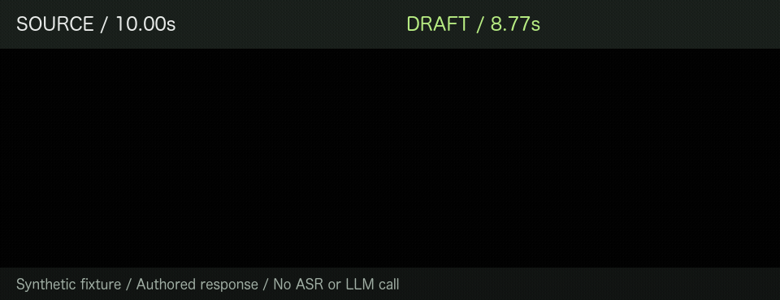
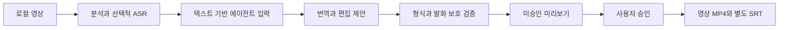
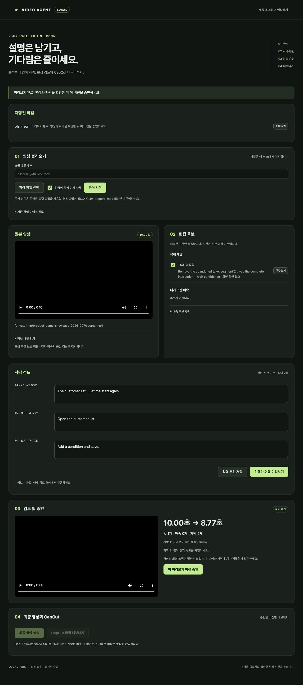

# Product Demo Editor

한국어 제품 데모에 영어 자막을 붙이고, 불필요한 설명이나 대기 구간을 줄이는 편집 도구입니다.

Codex가 번역과 편집안을 작성합니다. Python이 편집 구간과 승인 여부를 검사한 뒤 FFmpeg로 영상을 만듭니다.
Claude Code용 공통 스킬도 제공하지만 실제 호스트 실행은 아직 검증하지 않았습니다.



위 시연은 **합성 영상과 미리 작성한 응답**으로 다시 시작한 설명 하나를 제거한 결과입니다.
영상은 10.00초에서 8.77초로, 자막은 3개에서 2개로 줄었습니다. 이 예제에서는 ASR이나 LLM을 실행하지 않습니다.

[개발 사례](docs/case-study.md) · [설계와 구현](docs/architecture.md) · [공개 준비 검증](docs/publication-review.md)

## 만든 이유

첫 실제 영상에서는 전사와 자막 생성은 작동했지만 번역을 직접 입력해야 했고, 편집 결과도 거의 줄지 않았습니다.
그래서 번역과 편집안은 대화 중인 에이전트가 만들고, 영상 처리는 기존 로컬 도구가 맡도록 바꿨습니다.

- 삭제와 배속 후보에는 이유와 불확실한 부분, 화면을 직접 확인해야 하는지를 적습니다.
- 요청 해시와 구간 ID를 확인합니다. 남겨야 할 발화나 자막과 겹치는 편집은 거부합니다.
- 컷과 배속을 고정 프레임레이트(CFR) 기준으로 계산하고, 편집 후 시간에 맞춰 자막을 옮깁니다.
- 미리보기를 확인하고 승인해야 최종 영상을 만들 수 있습니다. 승인 후 계획이 바뀌면 다시 검토해야 합니다.
- 원본은 수정하지 않습니다. 실패한 작업은 해시가 일치하는 중간 결과부터 재개하고, UI에서 저장한 작업은 재시작 후 불러옵니다.

Python, Pydantic, FFmpeg와 표준 라이브러리 HTTP 서버를 사용합니다. 프런트엔드는 외부 의존성이 없는 HTML/CSS/JavaScript입니다.



## 설치와 첫 실행

Python 3.12 이상, FFmpeg, ffprobe가 필요합니다. **자막 렌더링에는 FFmpeg의 libass 필터가 필수**입니다.
macOS에서는 일반 `ffmpeg`에 필터가 없을 수 있으므로 다음 구성을 권장합니다.

```sh
# macOS / Homebrew
brew install python@3.12 ffmpeg-full
export PATH="$(brew --prefix ffmpeg-full)/bin:$PATH"
# Ubuntu / Debian에서는: sudo apt-get install ffmpeg python3-venv

python3.12 -m venv .venv
source .venv/bin/activate
python -m pip install -e '.[dev]'
video-agent doctor
```

Linux에서는 설치된 Python 버전에 맞춰 `python3.12` 대신 `python3`를 사용할 수 있습니다.
`doctor`는 실제 렌더러의 자막 필터까지 확인합니다. 준비되지 않았으면 원인을 출력하고 종료 코드 2를 반환합니다.
macOS의 Homebrew `ffmpeg-full` 경로는 자동 탐색합니다. 모델 패키지와 가중치는 이 단계에서 필요하지 않습니다.

먼저 합성 영상으로 편집과 미리보기를 실행해 보세요.

```sh
python scripts/demo_agent.py --output work/showcase
```

결과는 `work/showcase/draft/review.md`, `work/showcase/draft/plan.json`,
`work/showcase/preview/preview.mp4`입니다. 출력 폴더는 새 경로여야 하며 기존 결과를 덮어쓰지 않습니다.

실제 영상의 한국어 음성 인식이 필요하면 추가로 준비합니다.

```sh
python -m pip install -e '.[asr]'
video-agent prepare-model --model small
```

`prepare-model`은 가중치를 다운로드합니다. 분석 중에는 자동 다운로드하지 않습니다.
[초기 개발 환경의 버전 기록](docs/development-versions.txt)은 운영체제 공통 잠금 파일이 아닙니다.
설치는 `pyproject.toml`을 기준으로 합니다.

## 에이전트 스킬과 검토 화면

```sh
python scripts/install_skill.py --host codex
# Claude Code용: --host claude
```

설치기는 저장소의 스킬을 사용자 스킬 디렉터리에 심볼릭 링크로 연결하며 기존 스킬을 덮어쓰지 않습니다.
저장소와 `.venv`를 같은 위치에 유지하세요. 호스트가 스킬을 발견하지 못하면 새 대화에서 확인합니다.

```text
$product-demo-editor
/absolute/path/demo.mov 파일에 영어 자막을 만들고,
핵심 조작을 유지하면서 기다리는 부분을 줄이는 편집안을 제안해줘.
```

스킬은 현재 대화의 에이전트가 수행합니다. Python이 다른 에이전트 프로세스나 모델 API를 호출하지 않습니다.
세부 명령과 JSON 교환 규약은 [에이전트 워크플로](docs/agent-workflow.md)에 있습니다.

```sh
video-agent ui
```

터미널에 표시된 **세션 키를 포함한 전체 주소**로 접속합니다.
**계획 불러오기**로 `plan.json`을 열고, 제안을 선택해 미리보기를 생성한 뒤 해당 버전을 승인합니다.
UI만 실행해도 자동으로 번역이 시작되지는 않습니다. CLI 미리보기를 불러오는 대신 UI에서 다시 렌더링합니다.

<details>
<summary>합성 자료를 사용한 실제 검토 화면</summary>



스크린샷은 실제 로컬 UI에서 촬영했습니다. 비공개 영상과 전사는 포함하지 않았으며 최종 승인은 하지 않았습니다.

</details>

UI는 신뢰할 수 있는 로컬 단일 사용자용입니다. 인터넷에 공개하는 서버가 아닙니다.
미저장 입력은 작업을 전환하기 전에 초안으로 저장하세요. [UI 사용법](docs/ui.md)을 참고하세요.

## 구현 범위와 검증

| 항목 | 현재 범위 |
|---|---|
| 로컬 분석 | 영상 정보, 무음, 픽셀 변화, 선택적 faster-whisper 한국어 전사 |
| 편집 제안 | 영어 번역, 대기 삭제와 배속, 발화 구간 전체 삭제 |
| 검증과 실행 | 입력 해시, 편집 충돌, 발화 보호, 프레임 계산, 승인 변경 감지 |
| 검토 화면 | 미리보기, 승인, 작업 기록, 재시작 복구 |
| CapCut | 영상과 SRT 파일 교환. 네이티브 프로젝트와 원본 클립 타임라인은 미지원 |
| 호스트 | Codex 실제 비공개 영상 한 건의 실행 기록. Claude Code 실사용은 미검증 |
| 플랫폼 | macOS Apple Silicon 로컬 확인. Linux ASR 포함·미포함, macOS CI 통과 |

```sh
pytest -q
ruff check src tests scripts skills/product-demo-editor/scripts
ruff format --check src tests scripts skills/product-demo-editor/scripts
python -m pip check
```

합성 미디어와 실제 FFmpeg로 원본 보존, 발화 보호, 잘못된 응답 거부, 승인 변경 감지,
오디오와 영상 길이, 재시작 복구와 파일 교환을 검사합니다. ASR 포함 여부에 따라 실행하는 검사가 다릅니다.
[GitHub Actions](https://github.com/YongjunJeong/product-demo-editor/actions/runs/37930050760)에서 Linux의 ASR 포함/미포함 환경과 macOS 검사를 통과했습니다.
최신 로컬 결과와 도구 버전은 [공개 준비 검증](docs/publication-review.md)에 기록합니다.

## 데이터 처리와 한계

- 영상과 음성 분석, 렌더링은 로컬에서 수행하며 원본 영상, 음성, 프레임을 외부에 업로드하지 않습니다.
  전사와 용어집을 Codex/Claude에 제공하면 **호스트 서비스의 데이터 처리 정책**이 적용됩니다.
- 무음이 중요한 화면 조작을 포함할 수 있습니다. 전사만으로 화면 보존이나 번역 정확도를 보장하지 않습니다.
- 발화 삭제는 구간 전체 단위이며 자막 시간은 비례 배치합니다. 단어별 강제 정렬은 아닙니다.
- 미리보기에도 전체 해상도 편집 렌더를 먼저 수행합니다. 긴 영상의 처리 시간, HDR, 장시간 4K와 Windows는 추가 검증이 필요합니다.
- 해시는 파일 변경을 감지합니다. 사용자 인증이나 디지털 서명이 아닙니다.
- 실제 영상 한 건의 410초 → 380.73초 기록은 실행 확인이며 사람의 작업 시간 절감이나 모델 품질을 입증하지 않습니다.

[측정 기록](docs/benchmarks.md)과 [로드맵](docs/roadmap.md)에 추가 평가 항목을 기록했습니다.

## GitHub에 게시할 파일

소스, 테스트, 문서, 합성 JSON 예제와 검토한 시연 이미지만 공개합니다.
개인 영상, 전사, 모델, 환경과 작업 결과는 `runs/`, `work/` 등에 보관하며 공개하지 않습니다.

```sh
python scripts/package_portfolio.py --output work/portfolio-source.zip
```

패키징은 Git 저장소 밖에서도 작동합니다. 지정한 소스 폴더와 공개 이미지 두 개만 포함하고,
환경 파일, 원시 미디어, 심볼릭 링크와 주요 비밀정보 패턴을 거부합니다. 전사에 담긴 제품명이나 개인정보는 별도로 확인해야 합니다.
ZIP에는 Git 이력이 포함되지 않습니다. [게시 전 확인 사항](docs/publishing.md)에 따라 파일 목록을 확인하세요.

라이선스는 아직 지정하지 않았습니다.
